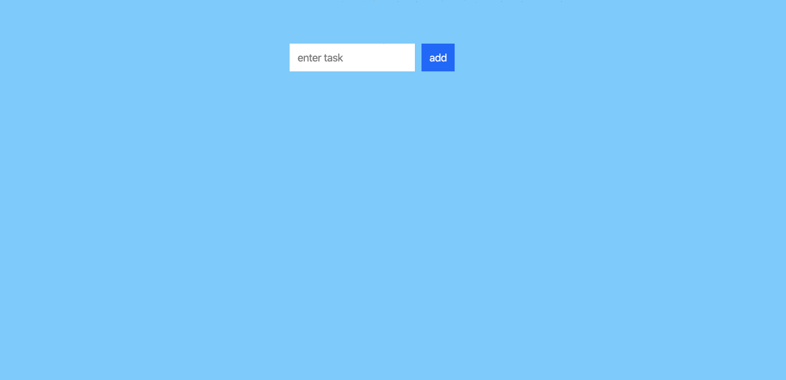

# TodoList Test

This repo contains a skeleton for a simple todo list along with corresponding tests that should pass when the app is completed. The goal of this test is to complete the app and make the tests pass.

The completed app looks like the animated gif below. When you type in text for a new task, pressing enter or clicking on the add button adds that new task to the list and clears out the input field. If you click on an individual task, it removes the task from the list. A task may not be entered with empty text.



## Setup

A recent nodejs and version of yarn are required.

```
# clone the repo
git clone https://github.com/postal-io/react-todo-list-tester.git
cd react-todo-list-tester

# install the dependencies
yarn

# start the app
yarn start

# run the tests
yarn test
```
